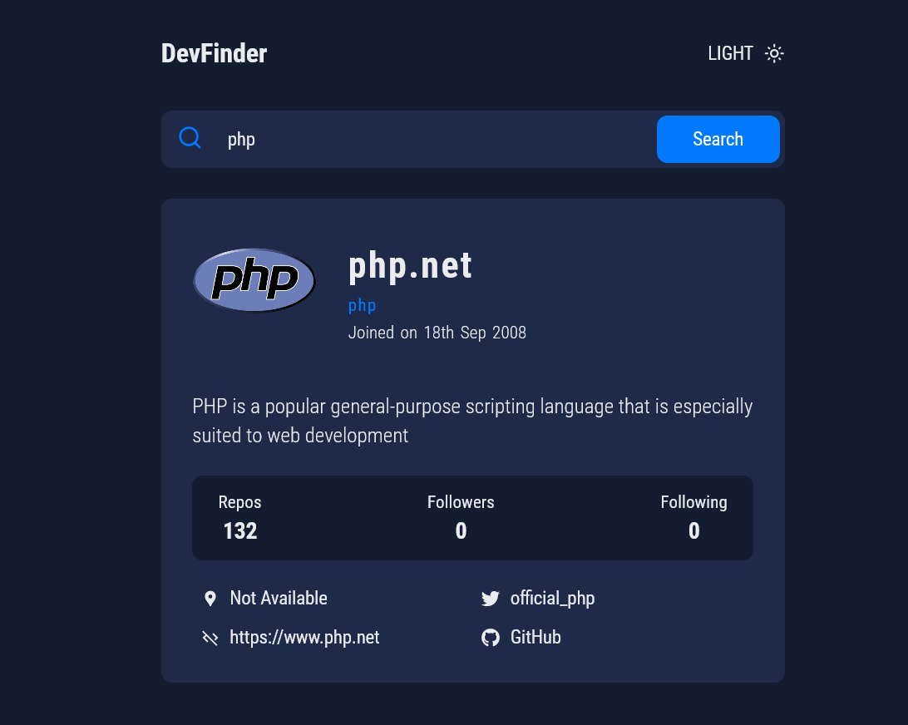

# GitHub user search app

### Frontend Mentor Challenge Project

This is Github Profile Search project, I have used the GitHub users API to pull profile data and display it. It's a great Project if you're looking to practice working with a 3rd-party API.

## Authors

- [@mhistiak3](https://github.com/mhistiak3)

## Screenshots



## Technology

**Client:** React, Custom Css, Github user api, React Icons, Moment js

## Run Locally

Clone the project

```bash
  gh clone https://github.com/mhistiak3/DevFinder.git
```

Go to the project directory

```bash
  cd devfinder
```

Install dependencies

```bash
  npm install
```

Start the server

```bash
  npm start
```


